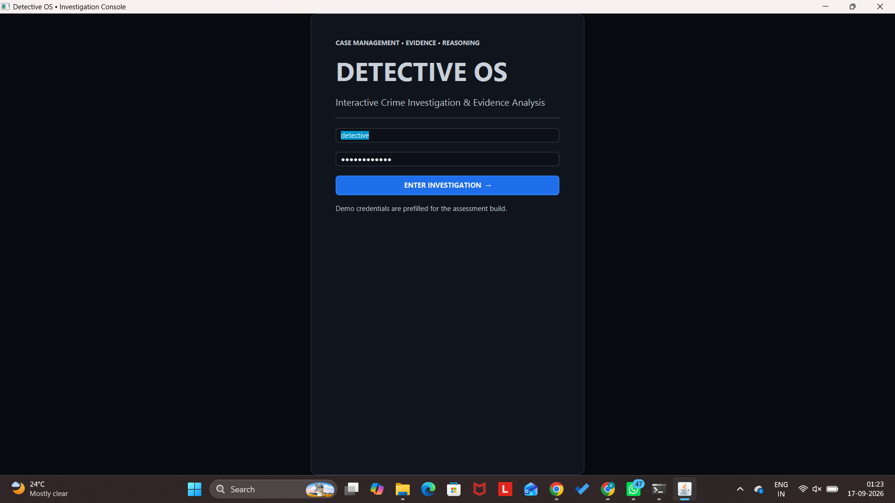
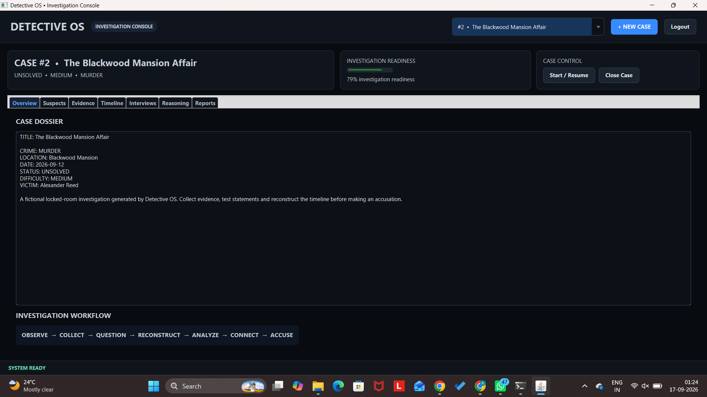
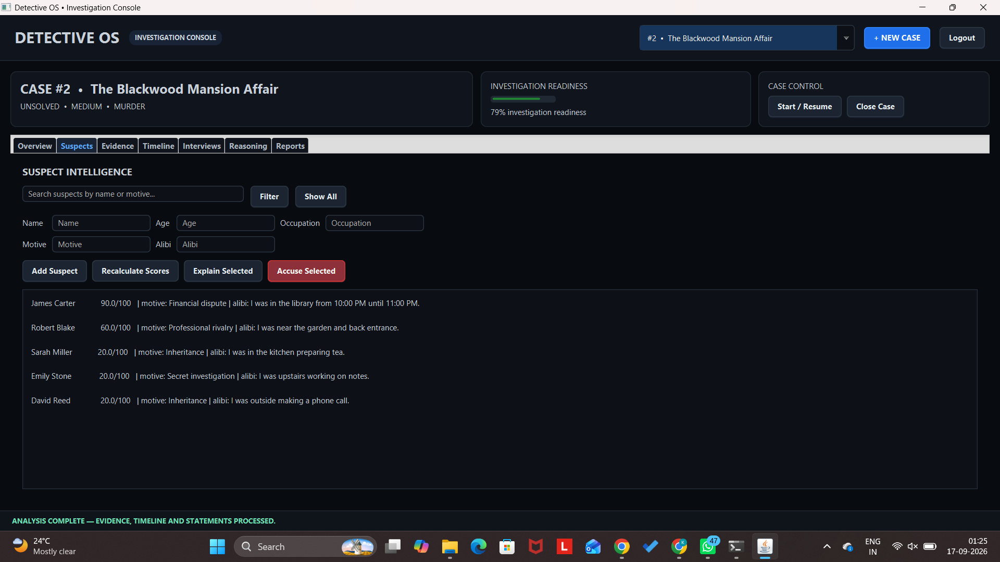
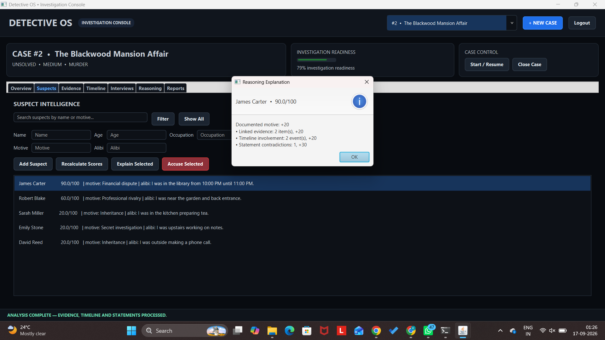
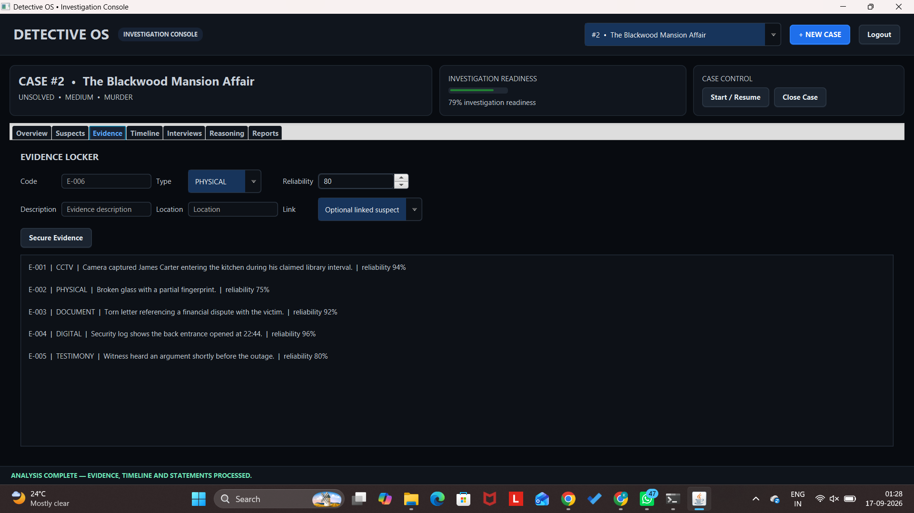
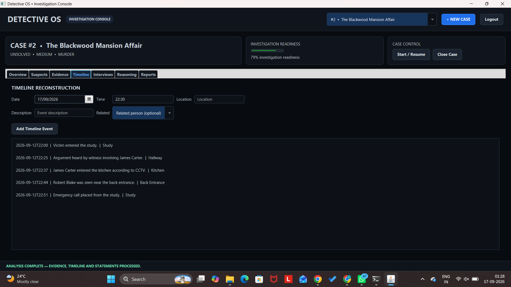
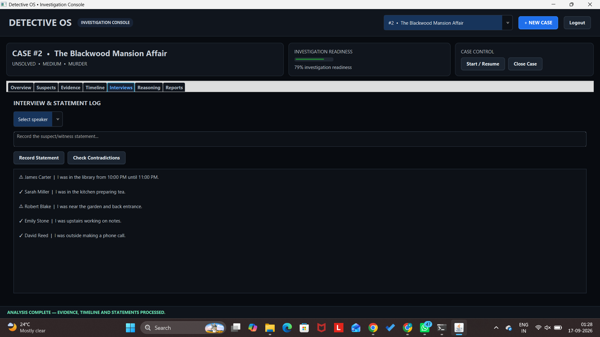
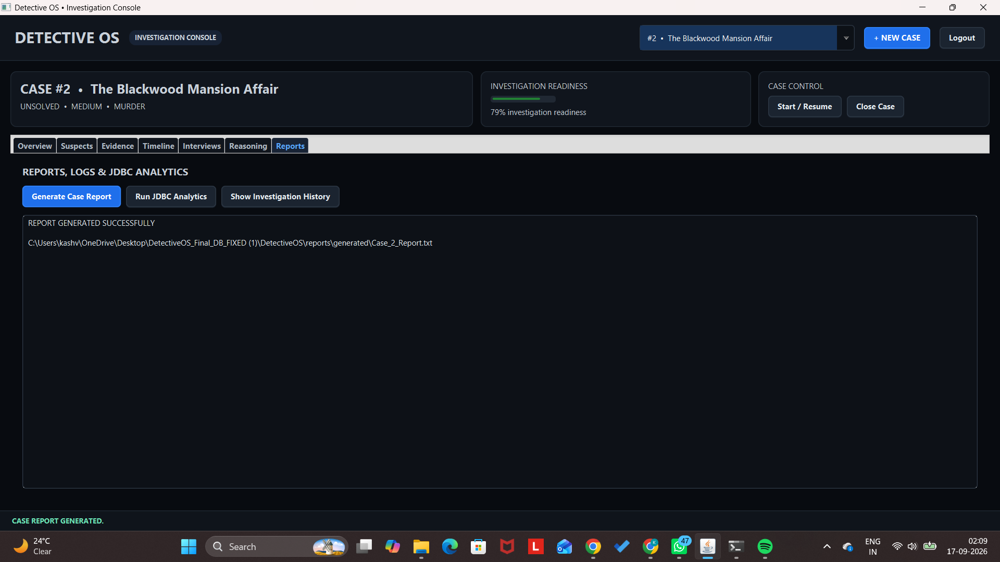
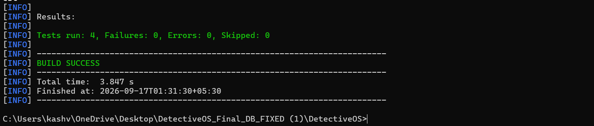

# Detective OS

### Interactive Crime Investigation & Evidence Analysis

Detective OS is a JavaFX-based educational crime-investigation application designed to demonstrate Java, Object-Oriented Programming, database, I/O, exception-handling, collections, reflection, and multithreading concepts through a fictional investigation workflow.

The application lets a user authenticate, manage fictional cases, examine suspects and evidence, reconstruct timelines, record statements, run concurrent reasoning analysis, calculate rule-based suspicion scores, record accusations, and generate investigation reports.

> **Educational disclaimer:** Detective OS is a fictional academic simulation. Its suspicion scoring and contradiction analysis are rule-based programming demonstrations and are not real forensic or law-enforcement analysis.

## 1. Objectives

- Apply Java OOP concepts in a complete application.
- Demonstrate encapsulation, inheritance, polymorphism, abstraction, interfaces, and enums.
- Implement exception handling and input validation.
- Demonstrate multithreading and synchronization.
- Use Java I/O for reports and investigation logs.
- Integrate JDBC and JPA/Hibernate with MySQL.
- Provide a modular JavaFX interface.
- Demonstrate testing using JUnit.
- Maintain the project using Git and GitHub.

## 2. Major Functional Modules

### Authentication & User Management
- Login and authentication validation.
- Logout functionality.

### Case Management
- View existing cases.
- Generate fictional cases.
- Start/resume and close investigations.
- Track case status, difficulty, crime type, victim, and readiness.
- Protect solved/closed cases from inappropriate modification.

### Suspect Management
- Search and view suspects.
- Add suspects.
- Calculate suspicion scores.
- Explain score components.
- Record accusations.

### Evidence Management
- Add and validate evidence.
- Store evidence type, reliability, location, description, and related suspect.
- Detect duplicate evidence codes.

### Timeline Reconstruction
- Add timeline events.
- Associate events with people.
- Display events chronologically.
- Use timeline information during reasoning.

### Interview & Statement Analysis
- Record statements.
- Compare statements with timeline information.
- Detect rule-based location contradictions.

### Concurrent Reasoning
- Run evidence, timeline, and statement analysis concurrently.
- Use synchronization when shared case state is modified.
- Calculate explainable, rule-based suspicion scores.

### Reports & Analytics
- Generate case reports.
- Save reports and investigation logs using Java I/O.
- Run JDBC analytics.
- View investigation history.

## 3. Suspicion Scoring

The educational scoring engine considers factors such as:

- documented motive;
- linked evidence;
- timeline involvement;
- statement contradictions.

The resulting score is capped at 100.

## 4. Java Concepts Demonstrated

| Concept | Example |
|---|---|
| Classes & Objects | Domain models and services |
| Encapsulation | Controlled model fields and operations |
| Inheritance | `Person` → `Suspect`, `Witness`, `Victim` |
| Abstraction | Abstract `Person` |
| Polymorphism | Person subclasses and engine/service interactions |
| Interfaces | `EvidenceAnalyzer` |
| Enums | Crime, evidence, case status, difficulty, person type |
| Exception Handling | Custom exceptions and validation |
| Collections | Lists, sets, maps and repositories |
| Multithreading | Concurrent analysis tasks |
| Synchronization | Shared investigation state |
| Static / Singleton-style management | JPA `EntityManagerFactory` |
| Reflection | `ReflectionInspector` |
| File I/O | Reports and investigation logs |
| JDBC | Analytics queries with prepared statements |
| JPA / Hibernate | Persistent entities |
| JUnit 5 | Automated tests |

## 5. Technology Stack

- **Java 21**
- **JavaFX 21.0.6**
- **Maven 3.9+**
- **MySQL 8+**
- **Jakarta Persistence API 3.1**
- **Hibernate ORM 6.6.4**
- **MySQL Connector/J 9.1.0**
- **JDBC**
- **JUnit 5.11.4**
- **Git / GitHub**

## 6. Architecture

```text
JavaFX UI
   |
Service Layer
   |
Reasoning / Engine Layer
   |---- Evidence Analysis
   |---- Timeline Analysis
   |---- Statement Analysis
   |
Repository / Persistence Layer
   |
MySQL
```

The application is organized into `config`, `engine`, `exception`, `model`, `repository`, `service`, `thread`, `ui`, and `util` packages.

## 7. Project Structure

```text
DetectiveOS/
├── README.md
├── statement.md
├── pom.xml
├── database_setup.sql
├── docker-compose.yml
├── run_windows.bat
├── run_linux.sh
├── .gitignore
├── docs/
│   ├── DIAGRAMS.md
│   ├── PROJECT_SPEC.md
│   ├── REPORT_OUTLINE.md
│   ├── SETUP.md
│   ├── SYLLABUS_MAPPING.md
│   ├── TEST_PLAN.md
│   ├── VIVA_NOTES.md
│   └── DetectiveOS_Project_Report_Draft.pdf
└── src/
    ├── main/
    │   ├── java/com/detectiveos/
    │   └── resources/
    └── test/
        └── java/com/detectiveos/
```

## 8. Requirements

Install:

- JDK 21
- Maven 3.9+
- MySQL 8+
- Git

Verify:

```bash
java -version
mvn -version
```

## 9. Database Setup

Make sure MySQL Server is running and execute `database_setup.sql`.

The local academic/demo configuration uses:

```text
Database: detective_os
Username: detective
Password: detective123
```

Hibernate/JPA creates and updates the application tables automatically.

Alternatively, if Docker is installed:

```bash
docker compose up -d
```

## 10. Run the Project

From the project root:

### Windows

```cmd
mvn clean test
mvn javafx:run
```

or:

```cmd
run_windows.bat
```

### Linux / macOS

```bash
mvn clean test
mvn javafx:run
```

The included Linux script can also be used:

```bash
./run_linux.sh
```

## 11. Demo Login

```text
Username: detective
Password: detective123
```

These are demo/local credentials for the academic database.

## 12. Recommended Demonstration Workflow

```text
Login
  ↓
Select / Generate Case
  ↓
Start Investigation
  ↓
Review Case Dossier
  ↓
Inspect Suspects
  ↓
Review Evidence
  ↓
Reconstruct Timeline
  ↓
Record / Review Statements
  ↓
Run Concurrent Analysis
  ↓
Recalculate Suspicion Scores
  ↓
Explain Selected Suspect
  ↓
Make an Accusation
  ↓
Generate Case Report
  ↓
Review Analytics / History
```

The seeded **Blackwood Mansion Affair** demonstrates evidence, timeline, statement contradiction, concurrent analysis, and explainable suspicion scoring.

## 13. Testing

Run:

```bash
mvn clean test
```

Automated tests currently cover suspicion scoring and input validation. The manual test plan in `docs/TEST_PLAN.md` additionally covers login, case management, evidence validation, duplicate evidence, timeline handling, contradiction detection, concurrent reasoning, suspicion explanations, accusations, closed-case protection, report generation, and JDBC analytics.

### Verified Build Result

The project was tested with Maven and produced:

```text
Tests run: 4
Failures: 0
Errors: 0
Skipped: 0
BUILD SUCCESS
```

## 14. Screenshots
The following screenshots demonstrate the major functional modules of Detective OS during execution.

### 14.1 Login Screen


### 14.2 Dashboard / Case Dossier


### 14.3 Suspect Management and Analysis


### 14.4 Suspicion Score Explanation


### 14.5 Evidence Management


### 14.6 Timeline Reconstruction


### 14.7 Interviews and Contradiction Analysis


### 14.8 Reasoning Analysis


### 14.9 Reports and Analytics


### 14.10 Automated Test Results


## 15. Documentation

The `docs/` directory contains:

- `PROJECT_SPEC.md` — project specification
- `DIAGRAMS.md` — design diagrams
- `SETUP.md` — setup reference
- `SYLLABUS_MAPPING.md` — Java syllabus mapping
- `TEST_PLAN.md` — testing plan
- `VIVA_NOTES.md` — viva preparation
- `REPORT_OUTLINE.md` — report structure
- `DetectiveOS_Project_Report_Draft.pdf` — report draft

## 16. Git Workflow

```bash
git status
git add .
git commit -m "Describe your changes"
git push
```

## 17. Academic Alignment

Detective OS is developed for **CSE2006 – Programming in Java** and integrates Java OOP, exception handling, collections, multithreading/synchronization, I/O, JDBC, JPA/Hibernate, modular design, and testing.

## 18. Future Enhancements

- Role-based access control.
- Richer evidence visualization.
- Configurable investigation rules.
- Expanded automated test coverage.
- Advanced timeline visualization.
- Additional case-generation scenarios.
- PDF report export.
- Environment-variable based database configuration.
- Database migration/versioning.

## 19. Academic Use

This project is developed for academic demonstration and evaluation.
