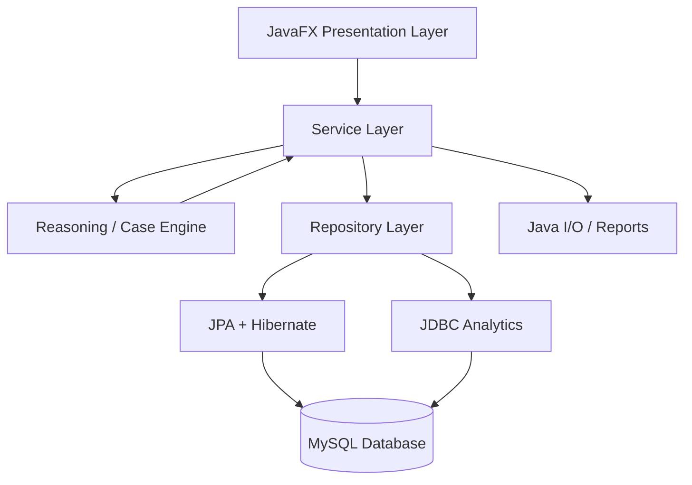
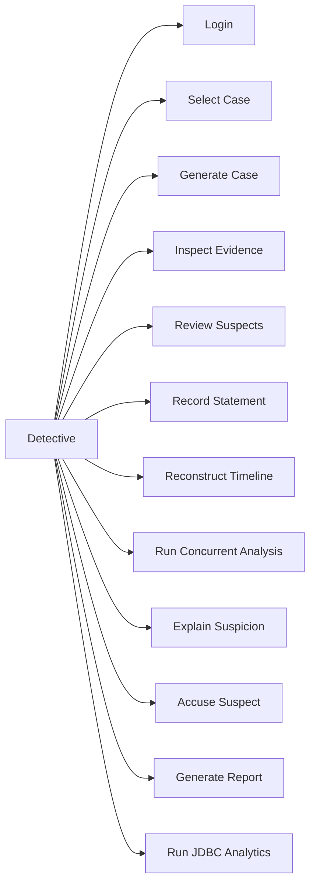
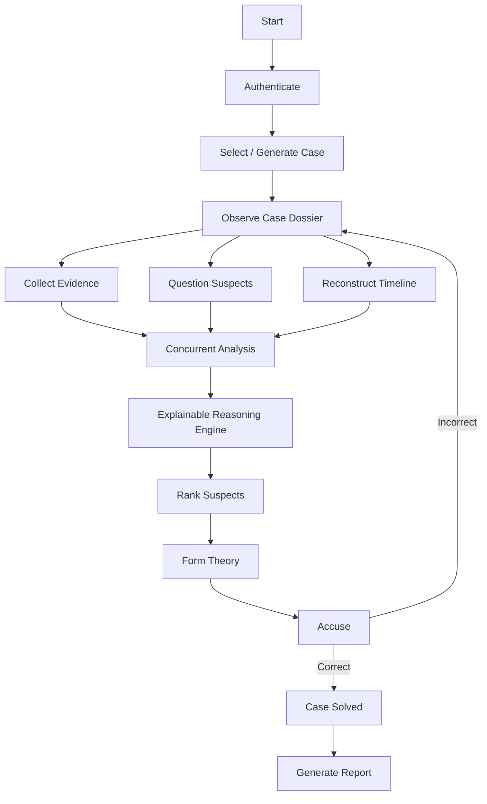
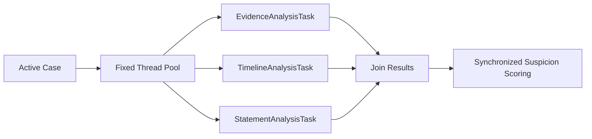
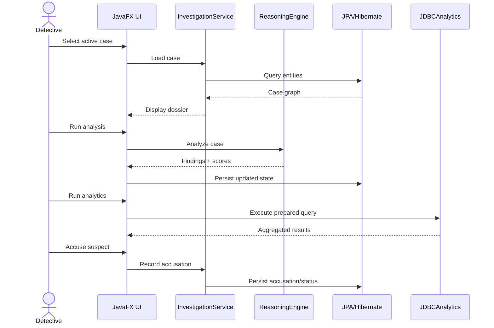
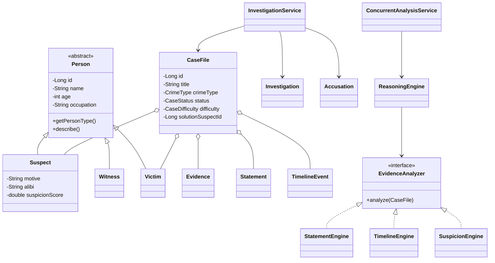
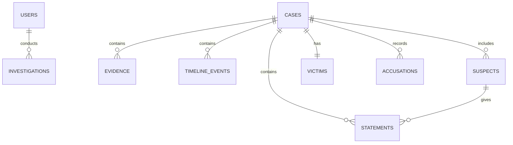

# Detective OS — Final Design Diagram Sources

These Mermaid diagrams can be rendered in Mermaid-compatible Markdown or recreated in draw.io/StarUML for the final report.

## 1. System Architecture

## 2. Use Case Diagram

## 3. Investigation Workflow

## 4. Concurrent Analysis

## 5. Sequence Diagram

## 6. Class Diagram

## 7. ER Diagram — Conceptual

